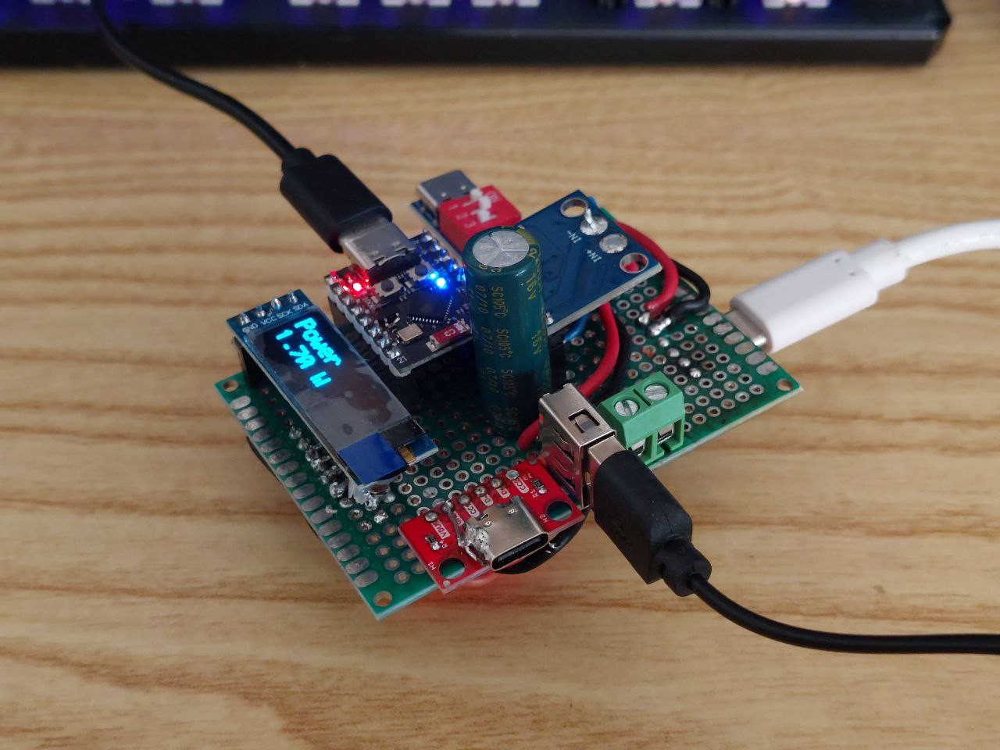
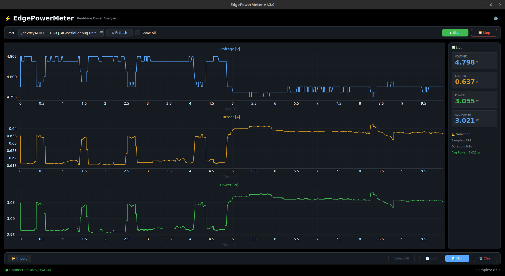
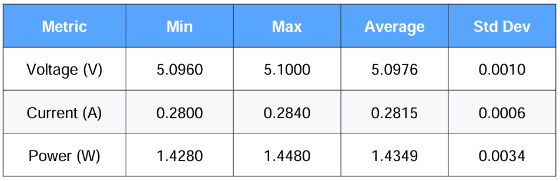
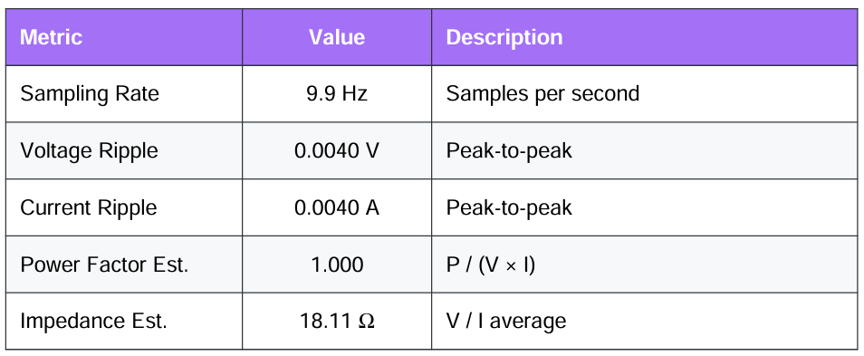
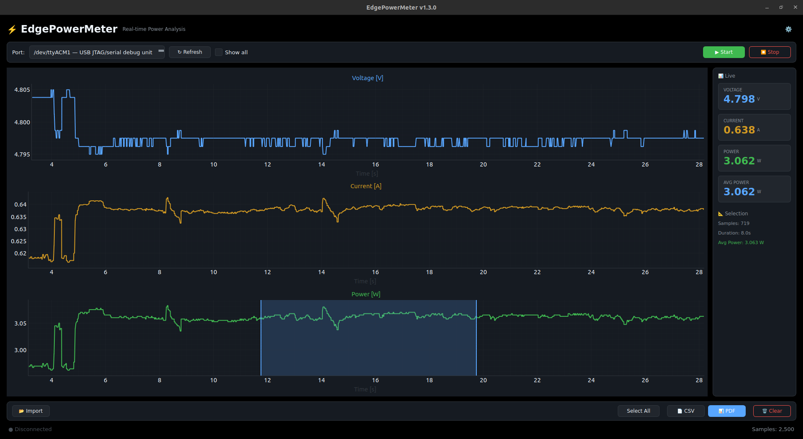
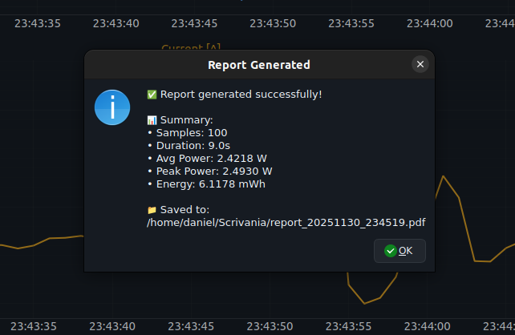

# EdgePowerMeter ⚡

<div align="center">



**A precision power monitoring system for embedded AI workloads**

[](LICENSE)
[]()
[]()

</div>

---

## 📋 Table of Contents

- [Overview](#-overview)
- [Features](#-features)
- [Desktop Application](#-desktop-application)
- [Hardware](#-hardware)
- [Installation](#-installation)
- [Building](#-building)
- [Usage](#-usage)
- [Safety Warning](#-safety-warning)
- [License](#-license)

---

## 🔎 Overview

**EdgePowerMeter** is a complete power monitoring solution designed to measure voltage, current, and power consumption of embedded devices running AI inference workloads. Perfect for benchmarking FPS-per-Watt (FPS/W) efficiency of machine learning models at the edge.

### Why EdgePowerMeter?

- **Precision Measurements**: INA226 power monitor with configurable averaging
- **Real-time Visualization**: Modern desktop app with live graphs
- **Data Export**: CSV and PDF report generation
- **Timestamped Logs**: DS3231 RTC for accurate time synchronization
- **Open Source**: Full hardware schematics and software included

---

## ✨ Features

### Hardware
- 🔋 **INA226** high-precision power monitor (I²C)
- 🕐 **DS3231** real-time clock for accurate timestamps
- 📺 **SSD1306** OLED display (128×32) for live readings
- ⚡ **ESP32-C3** microcontroller with WiFi/BLE capability
- 🔧 **0.01Ω shunt** resistor for current sensing

### Software
- 📊 Real-time voltage, current, and power graphs
- 📈 Live statistics with min/max/average values
- 💾 CSV data export with full measurement history
- 📄 Professional PDF report generation
- 🎨 Dark and Light theme support
- ⚙️ Configurable serial port settings
- 🔍 Zoom and pan on individual graphs
- 📐 Selection region for detailed analysis

---

## 🖥️ Desktop Application

The EdgePowerMeter desktop application provides a modern interface for real-time power monitoring and data analysis.

### Main Interface



The main window displays three synchronized graphs showing:
- **Voltage** (V) - Blue trace
- **Current** (mA) - Orange trace  
- **Power** (mW) - Green trace

### Statistics Panel

Real-time statistics are displayed in dedicated cards:



Each measurement type shows:
- Minimum value
- Maximum value
- Average value
- Total energy consumed (Wh)

### Derived Metrics



Advanced calculations including:
- Sampling rate (Hz)
- Voltage/Current ripple
- Power factor estimation
- Load impedance estimation

### Data Export



Export your data in multiple formats:
- **CSV**: Full measurement history with timestamps
- **PDF**: Professional report with statistics summary



---

## 🧩 Hardware

### Components

| Component | Model | I²C Address | Description |
|-----------|-------|-------------|-------------|
| MCU | ESP32-C3 SuperMini | - | Main microcontroller |
| Power Monitor | INA226 | 0x40 | Voltage/Current sensing |
| Display | SSD1306 | 0x3C | 128×32 OLED |
| RTC | DS3231 | 0x68 | Real-time clock |
| Shunt | R2512 | - | 0.01Ω current sense |

### Project Files

| File | Description |
|------|-------------|
| `Manufacture/BOM.csv` | Bill of Materials |
| `Manufacture/PickAndPlace.csv` | Pick and Place coordinates |
| `Schematics/EdgePowerMeter.fzz` | Fritzing schematic |
| `Schematics/EdgePowerMeter_bom.csv` | Schematic BOM |
| `EdgePowerMeter.ino` | Arduino firmware |

### Wiring Overview

All I²C devices share a common bus:
- **SDA**: GPIO8 (ESP32-C3)
- **SCL**: GPIO9 (ESP32-C3)
- **VCC**: 3.3V common rail
- **GND**: Common ground

The INA226 monitors voltage across the shunt resistor via `VIN+` (high side) and `VIN-` (low side).

---

## 📦 Installation

### Pre-built Binaries

Download the latest release for your platform from the [Releases](https://github.com/DanielRossi1/EdgePowerMeter/releases) page:

| Platform | File |
|----------|------|
| Linux (Debian/Ubuntu) | `edgepowermeter_x.x.x_amd64.deb` |
| Linux (Other) | `EdgePowerMeter` (standalone) |
| Windows | `EdgePowerMeter.exe` |
| macOS | `EdgePowerMeter.app` |

#### Linux (.deb)
```bash
sudo dpkg -i edgepowermeter_1.0.0_amd64.deb
edgepowermeter
```

#### Linux (standalone)
```bash
chmod +x EdgePowerMeter
./EdgePowerMeter
```

### From Source

```bash
# Clone the repository
git clone https://github.com/DanielRossi1/EdgePowerMeter.git
cd EdgePowerMeter

# Install Python dependencies
pip install PySide6 pyqtgraph pyserial reportlab numpy

# Run the application
python run.py
```

### Firmware

#### Arduino IDE
1. Install ESP32 board support
2. Install required libraries:
   - `INA226` by Rob Tillaart
   - `Adafruit_GFX`
   - `Adafruit_SSD1306`
   - `RTClib` by Adafruit
3. Open `EdgePowerMeter.ino`
4. Select board: `ESP32C3 Dev Module`
5. Upload

#### Arduino CLI

```bash
# Compile
arduino-cli compile --fqbn esp32:esp32:esp32c3 EdgePowerMeter

# Upload
arduino-cli upload -p /dev/ttyUSB0 --fqbn esp32:esp32:esp32c3 EdgePowerMeter
```

#### PlatformIO

```bash
pio run --target upload
```

---

## 🔨 Building

To build standalone executables for distribution:

```bash
# Install build dependencies
pip install pyinstaller

# Build executable + .deb package (Linux)
python build.py all

# Or just the executable
python build.py exe
```

Output files are created in `dist/`:
- `EdgePowerMeter` - Standalone executable
- `edgepowermeter_1.0.0_amd64.deb` - Debian package

📖 **See [docs/BUILD.md](docs/BUILD.md) for detailed build instructions**, including:
- Building on Windows and macOS
- Creating installers
- CI/CD integration
- Troubleshooting

---

## 🚀 Usage

### Quick Start

1. **Connect hardware** to your computer via USB
2. **Launch the app**: `python run.py` or run the executable
3. **Select serial port** from the dropdown
4. **Click Start** to begin recording

### Serial Output Format

The firmware outputs CSV data at 115200 baud with millisecond-precision timestamps:

```
Timestamp,Voltage[V],Current[A],Power[W]
2025-11-30 12:34:56.123,5.0123,0.2500,1.2531
2025-11-30 12:34:56.223,5.0118,0.2498,1.2525
```

The timestamp uses the DS3231 RTC with SQW sync for ±2ppm accuracy.

### Reading Serial Data (Linux)

```bash
# Using screen
screen /dev/ttyUSB0 115200

# Using cat
cat /dev/ttyUSB0
```

### Calculating FPS per Watt

```
FPS/W = Inference_FPS / Average_Power_W
```

**Example**: 30 FPS inference with 2.5W average = **12 FPS/W**

---

## ⚠️ Safety Warning

> **⚠️ IMPORTANT**: This project involves electrical connections. Incorrect wiring can cause damage, fire, or injury.

### Precautions

- ❌ **NOT designed for AC voltages**
- 🔌 Disconnect power before changing connections
- 🔍 Verify polarity with a multimeter before powering
- ⚡ Use appropriate fuses for your application
- 💧 Keep device dry and away from conductive materials
- 👨‍🔧 Seek professional help if unsure

**The author assumes no responsibility for damage or injury resulting from improper use.**

---

## 🛠️ Configuration

### Firmware Settings

Key configuration in `EdgePowerMeter.ino`:

```cpp
namespace Config {
    constexpr float SHUNT_RESISTANCE = 0.010f;      // Ohms
    constexpr float CURRENT_LSB_MA = 0.100f;        // mA resolution
    constexpr uint16_t INA226_AVERAGING = 16;       // Samples averaged
    constexpr uint32_t MEASUREMENT_INTERVAL = 10;   // ms between readings
}
```

### RTC Synchronization

Set `FORCE_RTC_UPDATE = true` in firmware to sync RTC with compile time on first boot.

---

## 📊 Specifications

| Parameter | Value |
|-----------|-------|
| Voltage Range | 0 - 36V |
| Current Range | ±3.2A (with 0.01Ω shunt) |
| Resolution | 1.25mV / 0.1mA |
| Sampling Rate | ~100 Hz |
| Serial Baud | 115200 |
| Display Update | 100ms |

---

## 📁 Project Structure

```
EdgePowerMeter/
├── EdgePowerMeter.ino      # Arduino firmware
├── run.py                  # Application entry point
├── build.py                # Build script for executables
├── app/
│   ├── main.py             # Application bootstrap
│   ├── serial/
│   │   └── reader.py       # Serial communication
│   └── ui/
│       ├── main_window.py  # Main GUI
│       ├── theme.py        # Dark/Light themes
│       ├── settings.py     # Settings dialog
│       └── report.py       # PDF/CSV export
├── assets/
│   └── prototype/          # Screenshots and photos
├── docs/
│   ├── BUILD.md            # Build instructions
│   ├── HARDWARE.md         # Hardware documentation
│   └── SOFTWARE.md         # Software documentation
├── Manufacture/            # PCB production files
└── Schematics/             # Circuit diagrams
```

---

## 🤝 Contributing

Contributions are welcome! Please feel free to submit issues and pull requests.

### TODO

- [ ] 3D printed enclosure design
- [ ] WiFi data streaming
- [ ] Mobile app companion
- [ ] Multi-device support
- [ ] Data logging to SD card

---

## 📜 License

This project is licensed under the **Apache License 2.0** - see the [LICENSE](LICENSE) file for details.

---

<div align="center">

**Made with ❤️ for the embedded AI community**

⭐ Star this repo if you find it useful!

</div>
