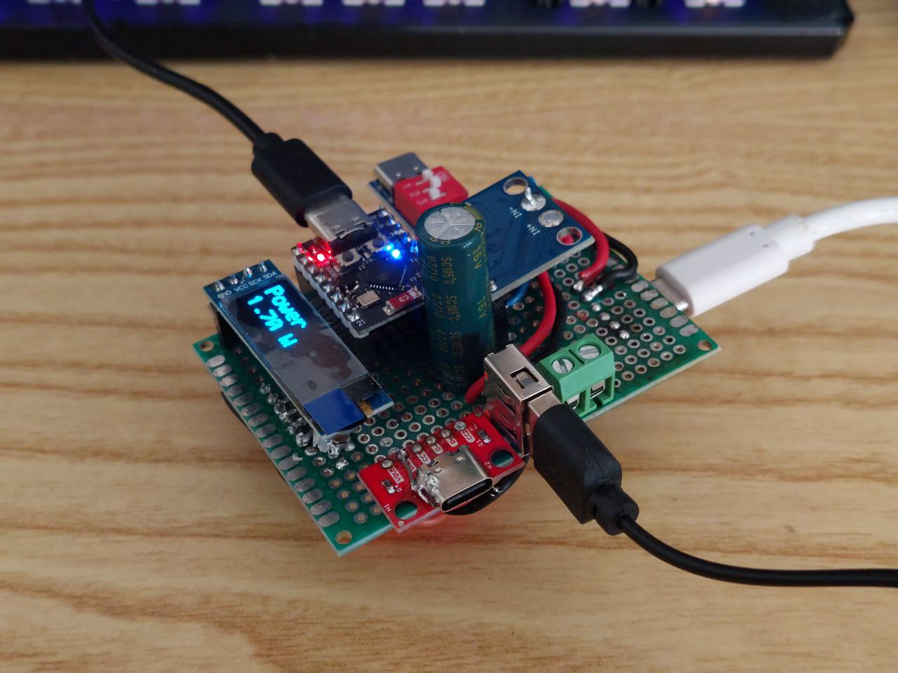
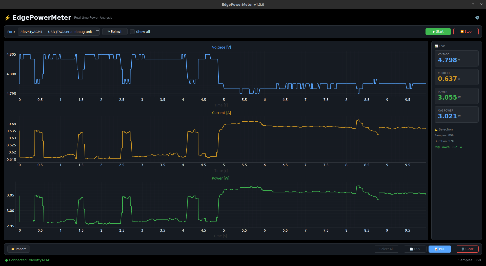
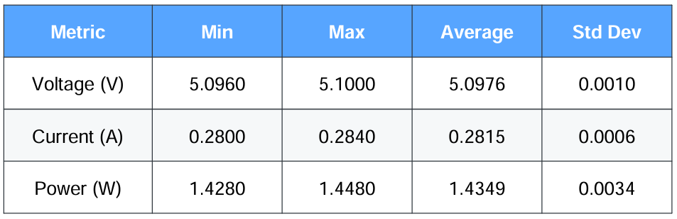
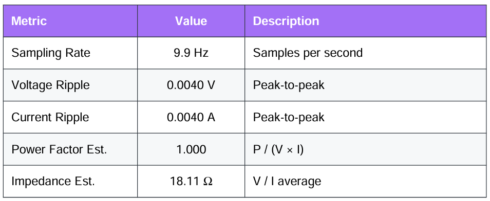
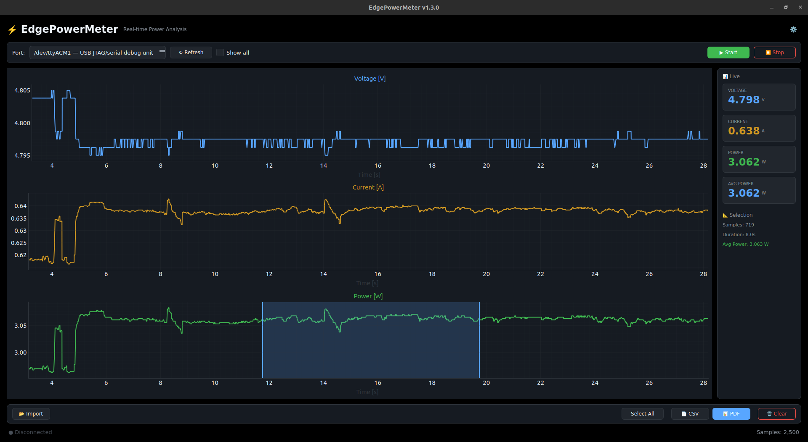
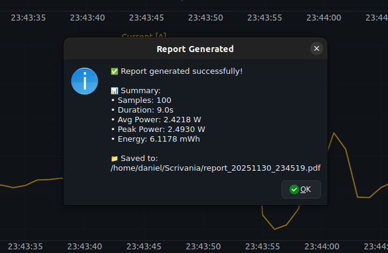

# EdgePowerMeter ⚡

<div align="center">



**A precision power monitoring system for embedded AI workloads**

[](LICENSE)
[]()
[]()

</div>

---

## 📋 Table of Contents

- [Overview](#-overview)
- [Features](#-features)
- [Desktop Application](#-desktop-application)
- [Hardware](#-hardware)
- [Installation](#-installation)
- [Building](#-building)
- [Usage](#-usage)
- [Safety Warning](#-safety-warning)
- [License](#-license)

---

## 🔎 Overview

**EdgePowerMeter** is a complete power monitoring solution designed to measure voltage, current, and power consumption of embedded devices running AI inference workloads. Perfect for benchmarking FPS-per-Watt (FPS/W) efficiency of machine learning models at the edge.

### Why EdgePowerMeter?

- **Precision Measurements**: INA226 power monitor with configurable averaging
- **Real-time Visualization**: Modern desktop app with live graphs
- **Data Export**: CSV and PDF report generation
- **Timestamped Logs**: DS3231 RTC for accurate time synchronization
- **Open Source**: Full hardware schematics and software included

---

## ✨ Features

### Hardware
- 🔋 **INA226** high-precision power monitor (I²C)
- 🕐 **DS3231** real-time clock for accurate timestamps
- 📺 **SSD1306** OLED display (128×32) for live readings
- ⚡ **ESP32-C3** microcontroller with WiFi/BLE capability
- 🔧 **0.01Ω shunt** resistor for current sensing

### Software
- 📊 Real-time voltage, current and power plots with peak-preserving decimation (smooth even after hours at ~1 kHz)
- ⏱️ **Device-clock time base** (firmware 2.x): sample spacing, energy and spectrum are not distorted by USB/PC latency
- 🧮 **Lost-sample detection** (sequence numbers) and real-time energy, charge, min/max and average power
- 🎛️ **Remote sensor configuration**: INA226 averaging and conversion times, presets from ~2 Hz to ~900 Hz, saved on the device
- 🕐 **Clock sync** of the DS3231 with the PC, with live device–PC offset
- 🎯 **Calibration** in the app: shunt value, current zero ("zero now"), voltage/current gain and offset
- 📐 **Analysis page**: selectable range, per-quantity statistics, power supply quality (ripple, noise, load regulation, settling time) and frequency spectrum
- 🚩 **Markers**: press `M` (or right-click the plot) to mark events; every segment between markers gets duration, energy, average and peak power
- 🏁 **Benchmark mode**: energy per inference, inferences per joule and FPS/W, also net of the idle power
- 💽 **Continuous recording**: every acquisition is saved while it runs to a visible CSV file (crash-safe, no duplicates, no hidden files)
- 💾 CSV export/import (decimal comma, date/time or Unix time) and PDF reports with vector charts
- 🌍 **5 languages** (English, Italiano, Español, Français, Deutsch), automatically selected from the system, translated offline with a local model
- 🎨 Dark, light or system theme, configurable units, digits, refresh rate, time window and more
- 🔌 **Safe auto-reconnect**: after an unplug the recording continues; a manual Stop never restarts it
- ⌨️ Keyboard shortcuts (Ctrl+R, Ctrl+O, Ctrl+E, Ctrl+P, Ctrl+1…5)

---

## 🖥️ Desktop Application

The EdgePowerMeter desktop application provides a modern interface for real-time power monitoring and data analysis.

### Main Interface



The window has a navigation rail with five pages: **Live**, **Analysis**,
**Device**, **Settings** and **About**. The Live page shows three synchronized
plots (voltage, current, power) with live value tiles; the Analysis page works
on a selected range of the recording. (Screenshots below are from version 1.x.)

### Statistics Panel

Real-time statistics are displayed in dedicated cards:



Each measurement type shows:
- Minimum value
- Maximum value
- Average value
- Total energy consumed (Wh)

### Derived Metrics



Advanced calculations including:
- **Sampling rate** (Hz) - real-time display with configurable subsampling
- **Voltage/Current ripple** - percentage and absolute values
- **Power supply quality** - ripple, load regulation, settling time, stability rating
- **Spectrum analysis** - dominant frequencies in load variations
- **Power factor estimation** - for AC/DC systems
- **Load impedance estimation** - dynamic resistance calculation

### Data Export



Export your data in multiple formats:
- **CSV**: Full measurement history with timestamps
- **PDF**: Professional report with statistics summary



---

## 🧩 Hardware

### Components

| Component | Model | I²C Address | Description |
|-----------|-------|-------------|-------------|
| MCU | ESP32-C3 SuperMini | - | Main microcontroller |
| Power Monitor | INA226 | 0x40 | Voltage/Current sensing |
| Display | SSD1306 | 0x3C | 128×32 OLED |
| RTC | DS3231 | 0x68 | Real-time clock |
| Shunt | R2512 | - | 0.01Ω current sense |

### Project Files

| File | Description |
|------|-------------|
| `Manufacture/BOM.csv` | Bill of Materials |
| `Manufacture/PickAndPlace.csv` | Pick and Place coordinates |
| `Schematics/EdgePowerMeter.fzz` | Fritzing schematic |
| `Schematics/EdgePowerMeter_bom.csv` | Schematic BOM |
| `firmware/firmware.ino` | Arduino firmware with libraries |

### Wiring Overview

All I²C devices share a common bus:
- **SDA**: GPIO8 (ESP32-C3)
- **SCL**: GPIO9 (ESP32-C3)
- **VCC**: 3.3V common rail
- **GND**: Common ground

The INA226 monitors voltage across the shunt resistor via `VIN+` (high side) and `VIN-` (low side).

---

## 📦 Installation

### Pre-built Binaries

Download the latest release for your platform from the [Releases](https://github.com/DanielRossi1/EdgePowerMeter/releases) page:

| Platform | File |
|----------|------|
| Linux (Snap Store) | `sudo snap install edgepowermeter` |
| Linux (Debian/Ubuntu) | `edgepowermeter_x.x.x_amd64.deb` |
| Linux (Other) | `EdgePowerMeter` (standalone) |
| Windows | `EdgePowerMeter.exe` |
| macOS (Intel) | `EdgePowerMeter-macos-x86_64.zip` |
| macOS (Apple Silicon) | `EdgePowerMeter-macos-arm64.zip` |

#### Linux (Snap Store) - Recommended
```bash
sudo snap install edgepowermeter
sudo snap connect edgepowermeter:raw-usb  # Required for USB serial access
edgepowermeter
```

#### Linux (.deb)
```bash
sudo dpkg -i edgepowermeter_1.0.0_amd64.deb
edgepowermeter
```

#### Linux (standalone)
```bash
chmod +x EdgePowerMeter
./EdgePowerMeter
```

### From Source

```bash
# Clone the repository
git clone https://github.com/DanielRossi1/EdgePowerMeter.git
cd EdgePowerMeter

# Create a virtual environment and install the app with its dependencies
python3 -m venv .venv
.venv/bin/pip install -e .          # PySide6, pyqtgraph, pyserial, reportlab, numpy, PyOpenGL

# Run the application
.venv/bin/python run.py
```

### Firmware

#### Arduino IDE
1. Install ESP32 board support
2. Install required libraries:
   - `Adafruit_GFX`
   - `Adafruit_SSD1306`
   - `RTClib` by Adafruit
   (the Rob Tillaart `INA226` library is no longer needed since firmware 2.0)
3. Open `firmware/firmware.ino`
4. Select board `ESP32C3 Dev Module` and set **USB CDC On Boot: Enabled**
5. Upload

#### Arduino CLI

```bash
arduino-cli compile --fqbn esp32:esp32:esp32c3:CDCOnBoot=cdc firmware
arduino-cli upload -p /dev/ttyACM0 --fqbn esp32:esp32:esp32c3:CDCOnBoot=cdc firmware
```

The desktop app also works with firmware 1.x, but device time, lost-sample
detection, sensor configuration and clock sync require firmware 2.x.

---

## 🔨 Building

To build standalone executables for distribution:

```bash
# Install build dependencies
pip install pyinstaller

# Build executable + .deb package (Linux)
python build.py all

# Or just the executable
python build.py exe
```

Output files are created in `dist/`:
- `EdgePowerMeter` - Standalone executable
- `edgepowermeter_1.0.0_amd64.deb` - Debian package

📖 **See [docs/BUILD.md](docs/BUILD.md) for detailed build instructions**, including:
- Building on Windows and macOS
- Creating installers
- CI/CD integration
- Troubleshooting

---

## 🚀 Usage

### Quick Start

1. **Connect hardware** to your computer via USB
2. **Launch the app**: `python run.py` or run the executable
3. **Select serial port** from the dropdown
4. **Click Start** to begin recording

### Serial Output Format

At boot the firmware prints human-readable CSV (also what firmware 1.x sends),
so it can be used with any serial monitor:

```
Timestamp,Voltage[V],Current[A],Power[W]
2026-10-08 12:34:56.123,5.01250,0.250000,1.253125
```

The desktop app performs a handshake and switches the device to a compact RAW
format with device time in µs, a sequence number and the raw INA226 registers.
See **[docs/PROTOCOL.md](docs/PROTOCOL.md)** for the full protocol and the
command set (`HELLO`, `GET`, `SET AVG/VCT/ICT/OLED/STREAM/SHUNT`, `SYNC`, `SAVE`).

### Reading Serial Data (Linux)

```bash
screen /dev/ttyACM0 2000000
```

### Calculating FPS per Watt

```
FPS/W = Inference_FPS / Average_Power_W
```

**Example**: 30 FPS inference with 2.5W average = **12 FPS/W**

---

## ⚠️ Safety Warning

> **⚠️ IMPORTANT**: This project involves electrical connections. Incorrect wiring can cause damage, fire, or injury.

### Precautions

- ❌ **NOT designed for AC voltages**
- 🔌 Disconnect power before changing connections
- 🔍 Verify polarity with a multimeter before powering
- ⚡ Use appropriate fuses for your application
- 💧 Keep device dry and away from conductive materials
- 👨‍🔧 Seek professional help if unsure

**The author assumes no responsibility for damage or injury resulting from improper use.**

---

## 🛠️ Configuration

### Sensor and Calibration

With firmware 2.x, averaging and conversion times are set from the **Device**
page of the app (or with serial commands) and can be stored on the device with
*Save as device default*. Calibration (shunt value, zero offset, gain) is
applied by the app, so no reflashing is needed.

### RTC Synchronization

Use *Sync clock with PC* on the Device page (or enable automatic sync on
connect). `FORCE_RTC_UPDATE = true` in the firmware still forces a one-time sync
to the compile time.

---

## 📊 Specifications

| Parameter | Value |
|-----------|---------|
| Voltage Range | 0 - 36V |
| Current Range | ±3.2A (with 0.01Ω shunt) |
| Resolution | 1.25 mV / 0.25 mA (2.5 µV shunt LSB) |
| Sampling Rate | ~2 Hz – ~900 Hz (configurable, default ~893 Hz) |
| Time Stamping | Device µs clock, anchored to the DS3231 SQW (±2 ppm) |
| Serial | Native USB-CDC (2000000 baud nominal) |
| Display Update | 4 Hz (non-blocking) |

---

## 📁 Project Structure

```
EdgePowerMeter/
├── firmware/                 # ESP32-C3 firmware (Arduino sketch)
│   ├── firmware.ino          # Sampling loop, protocol, commands
│   ├── INA226Lite.h/cpp      # Minimal INA226 driver
│   ├── PrecisionTime.h/cpp   # DS3231 SQW time anchors
│   └── OLEDStatus.h/cpp      # Non-blocking OLED display
├── app/
│   ├── main.py               # Bootstrap (GPU preflight, QApplication)
│   ├── core/                 # Samples store, statistics, PSU quality, spectrum, settings
│   ├── serial/               # Port I/O, protocol decoder, reader thread
│   ├── export/               # CSV import/export, PDF report, unit formatting
│   ├── i18n/                 # Runtime translations + generated catalogs
│   └── ui/                   # Main window, controller, pages, widgets, theme
├── tools/i18n/               # Offline machine-translation tool
├── tests/                    # pytest suite (headless, fake device)
├── docs/                     # BUILD, HARDWARE, SOFTWARE, PROTOCOL
├── Manufacture/              # PCB production files
└── Schematics/               # Circuit diagrams
```

---

## 🤝 Contributing

Contributions are welcome! Please feel free to submit issues and pull requests.

### TODO

- [ ] 3D printed enclosure design
- [ ] Mobile app companion
- [ ] Data logging to SD card
- [ ] Improved PCB design

---

## 📜 License

This project is licensed under the **Apache License 2.0** - see the [LICENSE](LICENSE) file for details.

---

<div align="center">

**Made with ❤️ for the embedded AI community**

⭐ Star this repo if you find it useful!

</div>
