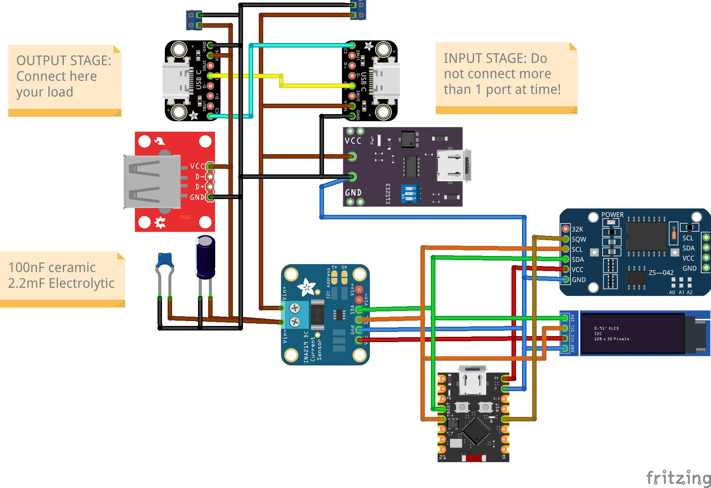

# EdgePowerMeter Hardware Documentation

This document provides detailed information about the EdgePowerMeter hardware design.

## Table of Contents

1. [Overview](#overview)
2. [Components](#components)
3. [Circuit Design](#circuit-design)
4. [Wiring Schematic](#wiring-schematic)
5. [PCB Files](#pcb-files)
6. [Assembly](#assembly)
7. [Calibration](#calibration)
8. [Troubleshooting](#troubleshooting)

---

## Overview

EdgePowerMeter is a precision power measurement device based on the INA226 current/voltage monitor. It's designed to measure power consumption of embedded devices, particularly for AI inference benchmarking.

### Prototype


*The assembled EdgePowerMeter prototype with ESP32-C3, INA226, DS3231 RTC, and SSD1306 OLED display.*

### Key Specifications

| Parameter | Value | Notes |
|-----------|-------|-------|
| Input Voltage Range | 0 - 36V | Bus voltage measurement |
| Current Range | ±3.2A | With 0.01Ω shunt |
| Voltage Resolution | 1.25mV | 16-bit ADC |
| Current Resolution | 0.1mA | Configurable LSB |
| Power Calculation | Internal | V × I computed by INA226 |
| Sampling Rate | ~100 Hz | Software configurable |
| Interface | USB Serial | 115200 baud |

---

## Components

### Bill of Materials

| Ref | Component | Value | Package | Description |
|-----|-----------|-------|---------|-------------|
| U1 | ESP32-C3 | SuperMini | Module | Microcontroller |
| U2 | INA226 | - | Module | Power monitor |
| U3 | SSD1306 | 128×32 | Module | OLED display |
| U4 | DS3231 | - | Module | Real-time clock |
| R1 | Shunt | 0.01Ω | R2512 | Current sense |

### Component Details

#### ESP32-C3 SuperMini

- **CPU**: 32-bit RISC-V @ 160MHz
- **Memory**: 400KB SRAM, 4MB Flash
- **Connectivity**: WiFi, BLE 5.0
- **GPIO**: 13 available pins
- **USB**: Native USB-C

#### INA226

- **Type**: Bidirectional current/power monitor
- **Interface**: I²C (address 0x40)
- **ADC**: 16-bit
- **Features**:
  - Programmable averaging (1-1024 samples)
  - Programmable conversion time
  - Alert functionality

#### DS3231

- **Type**: Precision RTC
- **Interface**: I²C (address 0x68)
- **Accuracy**: ±2ppm (0°C to +40°C)
- **Features**:
  - Temperature compensation
  - Battery backup
  - Alarm functions

#### SSD1306 OLED

- **Resolution**: 128×32 pixels
- **Interface**: I²C (address 0x3C)
- **Color**: Monochrome (white/blue)
- **Viewing Angle**: >160°

---

## Circuit Design

### Wiring Schematic

The complete wiring diagram for EdgePowerMeter:



*Complete wiring schematic showing all connections between ESP32-C3, INA226, DS3231, and SSD1306.*

### Vector Schematic

For high-resolution printing or editing, an SVG version is also available:

📄 **SVG File**: [`Schematics/EdgePowerMeter.svg`](../Schematics/EdgePowerMeter.svg)

### Block Diagram

```
                    ┌─────────────┐
                    │   DS3231    │
                    │     RTC     │
                    └──────┬──────┘
                           │ I²C
┌─────────┐    ┌───────────┼───────────┐    ┌─────────┐
│  LOAD   │◄───┤         ESP32-C3      ├───►│   USB   │
│ DEVICE  │    │      (SuperMini)      │    │ (Data)  │
└────┬────┘    └───────────┬───────────┘    └─────────┘
     │                     │ I²C
     │         ┌───────────┼───────────┐
     │         │                       │
     │    ┌────┴────┐            ┌─────┴─────┐
     │    │ INA226  │            │  SSD1306  │
     │    │ Power   │            │   OLED    │
     │    │ Monitor │            │  Display  │
     │    └────┬────┘            └───────────┘
     │         │
     └─────────┤
        Shunt  │
       0.01Ω   │
               │
         ┌─────┴─────┐
         │   POWER   │
         │   SOURCE  │
         └───────────┘
```

### I²C Bus

All I²C devices share a common bus:

| Signal | ESP32-C3 GPIO | Pull-up |
|--------|---------------|---------|
| SDA | GPIO8 | 4.7kΩ |
| SCL | GPIO9 | 4.7kΩ |

### I²C Device Addresses

| Device | Address | Function |
|--------|---------|----------|
| INA226 | 0x40 | Power monitor |
| SSD1306 | 0x3C | OLED display |
| DS3231 | 0x68 | Real-time clock |

### Power Rails

| Rail | Voltage | Source | Consumers |
|------|---------|--------|-----------|
| 3.3V | 3.3V | ESP32-C3 LDO | All I²C modules |
| VBUS | 5V | USB | ESP32-C3 |
| VLOAD | 0-36V | External | DUT (Device Under Test) |

### INA226 Connection Detail

```
POWER SOURCE (+) ──────────────┬─────────────── VIN+ (INA226)
                               │
                            ┌──┴──┐
                            │SHUNT│ 0.01Ω
                            │R2512│
                            └──┬──┘
                               │
POWER SOURCE (-) ──┬───────────┴─────────────── VIN- (INA226)
                   │
                   └─────────────────────────── LOAD (-)

LOAD (+) ──────────────────────────────────── Connected at VIN- side
```

**Important**: The load connects after the shunt resistor to measure current flowing through it.

---

## PCB Files

### Manufacturing Files

Located in `Manufacture/` directory:

| File | Description |
|------|-------------|
| [`BOM.csv`](../Manufacture/BOM.csv) | Bill of Materials for PCB |
| [`PickAndPlace.csv`](../Manufacture/PickAndPlace.csv) | Component placement coordinates |
| `gerber.zip` | Gerber files for PCB fabrication |

### Schematic Files

Located in `Schematics/` directory:

| File | Description |
|------|-------------|
| [`EdgePowerMeter.fzz`](../Schematics/EdgePowerMeter.fzz) | Fritzing project file |
| [`EdgePowerMeter.jpg`](../Schematics/EdgePowerMeter.jpg) | Wiring diagram (JPEG) |
| [`EdgePowerMeter.svg`](../Schematics/EdgePowerMeter.svg) | Wiring diagram (SVG) |
| [`EdgePowerMeter_bom.csv`](../Schematics/EdgePowerMeter_bom.csv) | Component BOM |

---

## Assembly

### Required Tools

- Soldering iron (temperature controlled)
- Fine tip (chisel or conical)
- Solder (0.5mm recommended)
- Flux (no-clean)
- Tweezers
- Multimeter
- Heat shrink tubing

### Assembly Steps

1. **Prepare Modules**
   - Verify all modules with multimeter
   - Check I²C addresses match expected values

2. **Wire I²C Bus**
   ```
   Connect in parallel:
   - SDA: All modules SDA pins
   - SCL: All modules SCL pins
   - VCC: All modules VCC pins (3.3V)
   - GND: All modules GND pins
   ```

3. **Install Shunt Resistor**
   - Use R2512 package (0.01Ω)
   - Ensure good solder joints (low resistance)
   - Verify with multimeter (should read ~0.01Ω)

4. **Connect INA226**
   - VIN+ to power source positive
   - VIN- to load positive (after shunt)

5. **Final Connections**
   - USB-C for programming and data
   - Optional: External power for higher currents

### Wiring Reference

Refer to the schematic for exact connections:


### Verification Checklist

- [ ] No shorts between VCC and GND
- [ ] I²C pull-ups installed
- [ ] All I²C addresses correct
- [ ] Shunt resistance verified
- [ ] USB connection working
- [ ] OLED displays on power-up

---

## Calibration

### Shunt Resistance Calibration

1. Measure actual shunt resistance with precision multimeter
2. Update firmware configuration:
   ```cpp
   namespace Config {
       constexpr float SHUNT_RESISTANCE = 0.0102f; // Measured value
   }
   ```

### Current Zero Offset

1. Remove load (open circuit)
2. Observe current reading
3. Adjust offset in firmware:
   ```cpp
   constexpr float CURRENT_ZERO_OFFSET_MA = -0.5f; // Adjust as needed
   ```

### Voltage Scaling

1. Apply known voltage (use precision source)
2. Compare reading with reference
3. Adjust scaling factor if needed:
   ```cpp
   constexpr uint16_t BUS_V_SCALING_E4 = 10050; // Fine tune
   ```

### INA226 Averaging

Configure averaging for your application:

| Setting | Samples | Noise Reduction | Response Time |
|---------|---------|-----------------|---------------|
| INA226_1_SAMPLE | 1 | None | Fastest |
| INA226_4_SAMPLES | 4 | Low | Fast |
| INA226_16_SAMPLES | 16 | Medium | Moderate |
| INA226_64_SAMPLES | 64 | High | Slow |
| INA226_128_SAMPLES | 128 | Very High | Very Slow |

---

## Troubleshooting

### No Serial Output

1. Check USB connection
2. Verify correct COM port selected
3. Ensure baud rate is 115200
4. Check ESP32-C3 is powered (LED on)

### I²C Devices Not Found

1. Check wiring continuity
2. Verify 3.3V power to all modules
3. Confirm pull-up resistors installed
4. Run I²C scanner sketch:
   ```cpp
   #include <Wire.h>
   
   void setup() {
       Wire.begin(8, 9); // SDA, SCL
       Serial.begin(115200);
       
       for(byte addr = 1; addr < 127; addr++) {
           Wire.beginTransmission(addr);
           if(Wire.endTransmission() == 0) {
               Serial.printf("Found: 0x%02X\n", addr);
           }
       }
   }
   
   void loop() {}
   ```

### Incorrect Current Readings

1. Verify shunt resistance value
2. Check current LSB configuration
3. Ensure shunt connections are solid
4. Look for ground loops

### OLED Not Working

1. Verify I²C address (0x3C for 128×32)
2. Check VCC is 3.3V
3. Try different I²C address (0x3D)
4. Check for physical damage

### RTC Wrong Time

1. Check RTC battery
2. Set `FORCE_RTC_UPDATE = true` in firmware
3. Recompile and upload
4. Time will sync on boot

### Power Measurement Inaccurate

1. Calibrate shunt resistance
2. Check for voltage drop in wires
3. Verify load connection point
4. Use shorter, thicker wires

---

## Safety Notes

⚠️ **WARNING**: This device is not isolated. The measurement circuit shares ground with USB.

### Safe Operating Limits

| Parameter | Maximum | Notes |
|-----------|---------|-------|
| Bus Voltage | 36V | INA226 limit |
| Continuous Current | 3A | Shunt thermal limit |
| Peak Current | 5A | Brief peaks only |
| Operating Temp | 0-70°C | Ambient |

### DO NOT

- ❌ Exceed 36V bus voltage
- ❌ Connect to AC mains
- ❌ Reverse polarity
- ❌ Create ground loops
- ❌ Operate in wet conditions

---

## References

- [INA226 Datasheet](https://www.ti.com/product/INA226)
- [DS3231 Datasheet](https://www.analog.com/DS3231)
- [ESP32-C3 Technical Reference](https://www.espressif.com/en/products/socs/esp32-c3)
- [SSD1306 Datasheet](https://cdn-shop.adafruit.com/datasheets/SSD1306.pdf)
