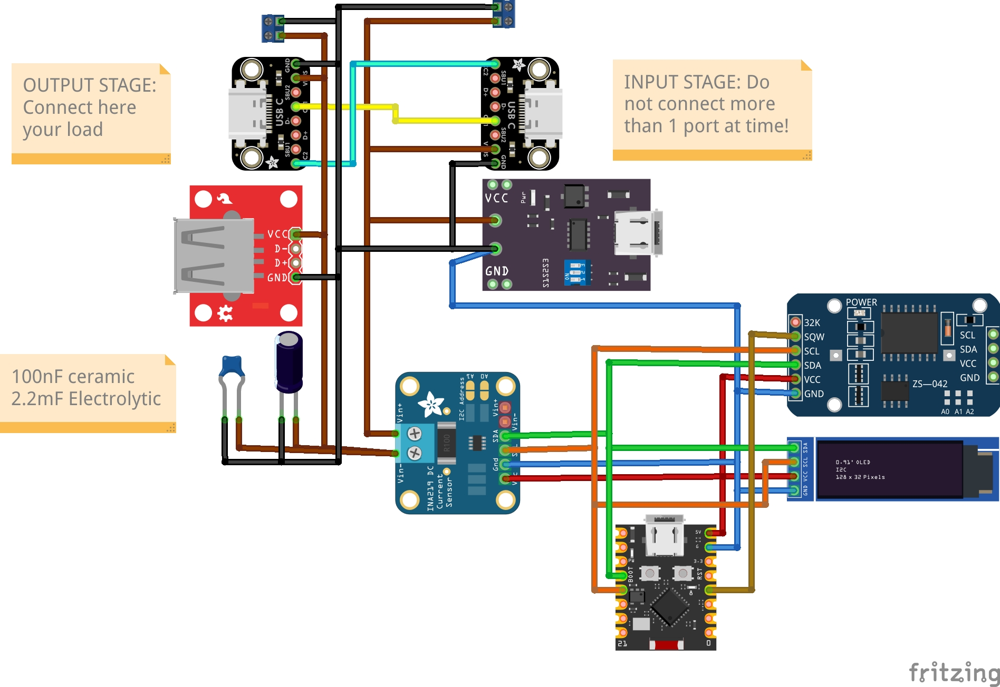

# EdgePowerMeter Hardware Documentation

This document provides detailed information about the EdgePowerMeter hardware design.

## Table of Contents

1. [Overview](#overview)
2. [Components](#components)
3. [Circuit Design](#circuit-design)
4. [Wiring Schematic](#wiring-schematic)
5. [PCB Files](#pcb-files)
6. [Assembly](#assembly)
7. [Calibration](#calibration)
8. [Troubleshooting](#troubleshooting)

---

## Overview

EdgePowerMeter is a precision power measurement device based on the INA226 current/voltage monitor. It's designed to measure power consumption of embedded devices, particularly for AI inference benchmarking.

### Prototype


*The assembled EdgePowerMeter prototype with ESP32-C3, INA226, DS3231 RTC, and SSD1306 OLED display.*

### Key Specifications

| Parameter | Value | Notes |
|-----------|-------|-------|
| Input Voltage Range | 0 - 36V | Bus voltage measurement |
| Current Range | ±3.2A | With 0.01Ω shunt |
| Voltage Resolution | 1.25mV | 16-bit ADC |
| Current Resolution | 0.25mA | Shunt LSB 2.5µV / 0.01Ω |
| Power Calculation | Host | V × I computed per sample from raw registers |
| Sampling Rate | up to ~890 Hz | Set by INA226 averaging and conversion times (default 4 × (140+140) µs) |
| Interface | Native USB-CDC | Protocol v2, see [PROTOCOL.md](PROTOCOL.md) |

---

## Components

### Bill of Materials

| Ref | Component | Value | Package | Description |
|-----|-----------|-------|---------|-------------|
| U1 | ESP32-C3 | SuperMini | Module | Microcontroller |
| U2 | INA226 | - | Module | Power monitor |
| U3 | SSD1306 | 128×32 | Module | OLED display |
| U4 | DS3231 | - | Module | Real-time clock |
| R1 | Shunt | 0.01Ω | R2512 | Current sense |

### Component Details

#### ESP32-C3 SuperMini

- **CPU**: 32-bit RISC-V @ 160MHz
- **Memory**: 400KB SRAM, 4MB Flash
- **Connectivity**: WiFi, BLE 5.0
- **GPIO**: 13 available pins
- **USB**: Native USB-C

#### INA226

- **Type**: Bidirectional current/power monitor
- **Interface**: I²C (address 0x40)
- **ADC**: 16-bit
- **Features**:
  - Programmable averaging (1-1024 samples)
  - Programmable conversion time
  - Alert functionality

#### DS3231

- **Type**: Precision RTC
- **Interface**: I²C (address 0x68)
- **Accuracy**: ±2ppm (0°C to +40°C)
- **Features**:
  - Temperature compensation
  - Battery backup
  - Alarm functions

#### SSD1306 OLED

- **Resolution**: 128×32 pixels
- **Interface**: I²C (address 0x3C)
- **Color**: Monochrome (white/blue)
- **Viewing Angle**: >160°

---

## Circuit Design

### Wiring Schematic

The complete wiring diagram for EdgePowerMeter:



*Complete wiring schematic showing all connections between ESP32-C3, INA226, DS3231, and SSD1306.*

### Vector Schematic

For high-resolution printing or editing, an SVG version is also available:

📄 **SVG File**: [`Schematics/EdgePowerMeter.svg`](../Schematics/EdgePowerMeter.svg)

### Block Diagram

```
                    ┌─────────────┐
                    │   DS3231    │
                    │     RTC     │
                    └──────┬──────┘
                           │ I²C
┌─────────┐    ┌───────────┼───────────┐    ┌─────────┐
│  LOAD   │◄───┤         ESP32-C3      ├───►│   USB   │
│ DEVICE  │    │      (SuperMini)      │    │ (Data)  │
└────┬────┘    └───────────┬───────────┘    └─────────┘
     │                     │ I²C
     │         ┌───────────┼───────────┐
     │         │                       │
     │    ┌────┴────┐            ┌─────┴─────┐
     │    │ INA226  │            │  SSD1306  │
     │    │ Power   │            │   OLED    │
     │    │ Monitor │            │  Display  │
     │    └────┬────┘            └───────────┘
     │         │
     └─────────┤
        Shunt  │
       0.01Ω   │
               │
         ┌─────┴─────┐
         │   POWER   │
         │   SOURCE  │
         └───────────┘
```

### I²C Bus

All I²C devices share a common bus:

| Signal | ESP32-C3 GPIO | Pull-up |
|--------|---------------|---------|
| SDA | GPIO8 | 4.7kΩ |
| SCL | GPIO9 | 4.7kΩ |

### SQW Precision Timing

The DS3231 SQW (Square Wave) output provides a precise 1Hz signal for millisecond-accurate timestamps:

| Signal | ESP32-C3 GPIO | Pin Label | Function |
|--------|---------------|-----------|----------|
| SQW | GPIO3 | A3 | 1Hz interrupt for time sync |

**How it works:**
1. DS3231 outputs a 1Hz square wave on SQW pin; its falling edge marks the start of a new RTC second
2. ESP32 captures the falling edge in an interrupt with `esp_timer_get_time()` (µs resolution)
3. Shortly after, when the sampling loop has spare time, the RTC second is read and paired with the edge time: this is a *time anchor*
4. Every sample carries the device µs timestamp of its conversion; the host maps it to wall-clock time through the latest anchor (in RAW mode the anchors are sent once per second as `T` lines)
5. Result: µs-resolution sample timing with the DS3231's ±2ppm long-term accuracy

If no SQW edge is detected (pin not wired), the firmware falls back to polling the RTC seconds register around the expected boundary (≈ ms accuracy); the OLED status line then shows `RTC` instead of `SQW`.

### I²C Device Addresses

| Device | Address | Function |
|--------|---------|----------|
| INA226 | 0x40 | Power monitor |
| SSD1306 | 0x3C | OLED display |
| DS3231 | 0x68 | Real-time clock |

### Power Rails

| Rail | Voltage | Source | Consumers |
|------|---------|--------|-----------|
| 3.3V | 3.3V | ESP32-C3 LDO | All I²C modules |
| VBUS | 5V | USB | ESP32-C3 |
| VLOAD | 0-36V | External | DUT (Device Under Test) |

### INA226 Connection Detail

```
POWER SOURCE (+) ──────────────┬─────────────── VIN+ (INA226)
                               │
                            ┌──┴──┐
                            │SHUNT│ 0.01Ω
                            │R2512│
                            └──┬──┘
                               │
POWER SOURCE (-) ──┬───────────┴─────────────── VIN- (INA226)
                   │
                   └─────────────────────────── LOAD (-)

LOAD (+) ──────────────────────────────────── Connected at VIN- side
```

**Important**: The load connects after the shunt resistor to measure current flowing through it.

---

## PCB Files

### Manufacturing Files

Located in `Manufacture/` directory:

| File | Description |
|------|-------------|
| [`BOM.csv`](../Manufacture/BOM.csv) | Bill of Materials for PCB |
| [`PickAndPlace.csv`](../Manufacture/PickAndPlace.csv) | Component placement coordinates |
| `gerber.zip` | Gerber files for PCB fabrication |

### Schematic Files

Located in `Schematics/` directory:

| File | Description |
|------|-------------|
| [`EdgePowerMeter.fzz`](../Schematics/EdgePowerMeter.fzz) | Fritzing project file |
| [`EdgePowerMeter.jpg`](../Schematics/EdgePowerMeter.jpg) | Wiring diagram (JPEG) |
| [`EdgePowerMeter.svg`](../Schematics/EdgePowerMeter.svg) | Wiring diagram (SVG) |
| [`EdgePowerMeter_bom.csv`](../Schematics/EdgePowerMeter_bom.csv) | Component BOM |

---

## Assembly

### Required Tools

- Soldering iron (temperature controlled)
- Fine tip (chisel or conical)
- Solder (0.5mm recommended)
- Flux (no-clean)
- Tweezers
- Multimeter
- Heat shrink tubing

### Assembly Steps

1. **Prepare Modules**
   - Verify all modules with multimeter
   - Check I²C addresses match expected values

2. **Wire I²C Bus**
   ```
   Connect in parallel:
   - SDA: All modules SDA pins
   - SCL: All modules SCL pins
   - VCC: All modules VCC pins (3.3V)
   - GND: All modules GND pins
   ```

3. **Install Shunt Resistor**
   - Use R2512 package (0.01Ω)
   - Ensure good solder joints (low resistance)
   - Verify with multimeter (should read ~0.01Ω)

4. **Connect INA226**
   - VIN+ to power source positive
   - VIN- to load positive (after shunt)

5. **Final Connections**
   - USB-C for programming and data
   - Optional: External power for higher currents

### Wiring Reference

Refer to the schematic for exact connections:


### Verification Checklist

- [ ] No shorts between VCC and GND
- [ ] I²C pull-ups installed
- [ ] All I²C addresses correct
- [ ] Shunt resistance verified
- [ ] USB connection working
- [ ] OLED displays on power-up

---

## Firmware

The sketch lives in `firmware/` (version 2.x, serial protocol v2 documented in
[PROTOCOL.md](PROTOCOL.md)).

| File | Purpose |
|------|---------|
| `firmware.ino` | Main loop: sampling, serial output, command parser, NVS settings |
| `INA226Lite.h/.cpp` | Minimal INA226 driver (raw registers, conversion-ready polling) |
| `PrecisionTime.h/.cpp` | DS3231 time anchors (SQW interrupt, polling fallback) |
| `OLEDStatus.h/.cpp` | SSD1306 display with non-blocking chunked frame transfer |

**Required libraries:** `RTClib`, `Adafruit SSD1306`, `Adafruit GFX Library`
(and their dependency `Adafruit BusIO`). The Rob Tillaart `INA226` library is
**no longer required**.

**Build** (board *ESP32C3 Dev Module*, *USB CDC On Boot: Enabled*):

```bash
arduino-cli compile --fqbn esp32:esp32:esp32c3:CDCOnBoot=cdc firmware
arduino-cli upload -p /dev/ttyACM0 --fqbn esp32:esp32:esp32c3:CDCOnBoot=cdc firmware
```

**How sampling works:**
- The INA226 runs in continuous shunt+bus mode. The firmware polls its
  conversion-ready flag (the ALERT pin is not wired) and reads the shunt and
  bus registers only when a new conversion is available, so every sample is a
  fresh, non-duplicated conversion with its own µs timestamp.
- Polling starts at ~85% of the conversion period; the time before that is used
  for RTC reads and for the OLED, whose 512-byte frames are sent in 16-byte
  chunks between conversions instead of one ~13 ms blocking transfer.
- If the host stops reading, data lines are dropped instead of blocking; the
  sequence number keeps counting so the app can report lost samples.
- `loop()` never returns: the Arduino core otherwise sleeps 5 ms every 2 s
  between `loop()` calls on single-core chips (`yieldIfNecessary()`), which
  dropped ~4 conversions each time. The idle-task watchdog is disabled for
  this reason. Measured on hardware (default settings, no SQW): 0 lines lost
  and ~0.015 % conversions missed, versus ~0.4 % before.
- At boot the device prints `#`-prefixed info lines and the legacy CSV header,
  then streams in CSV mode until the app switches it to RAW mode.

---

## Calibration

With firmware 2.x the device streams the **raw** INA226 shunt and bus
registers (RAW mode); conversion to volts/amps/watts and all calibration
(shunt resistance, current offset, gain factors) happen in the desktop app,
so no reflashing is needed to calibrate.

### Shunt Resistance Calibration

1. Measure the actual shunt resistance with a precision multimeter (4-wire if possible)
2. Enter the measured value in the desktop app settings
3. Optionally store it on the device too (used only for the OLED and the legacy CSV output):
   `SET SHUNT 0.0102` followed by `SAVE`

### Current Zero Offset

1. Remove the load (open circuit)
2. Use the app's zero-offset calibration, which subtracts the measured idle current

### Voltage Scaling

1. Apply a known voltage (precision source)
2. Compare the reading with the reference and set the voltage gain in the app

### INA226 Averaging and Conversion Time

The sample period is `(VBUSCT + VSHCT) × AVG`. Configure it from the app or
with serial commands (`SET AVG <n>`, `SET VCT <µs>`, `SET ICT <µs>`, then
`SAVE` to keep it across reboots):

| AVG | Conversion time (each) | Period | Rate | Noise |
|-----|------------------------|--------|------|-------|
| 1 | 140 µs | 280 µs | ~3.6 kHz* | Highest |
| 4 (default) | 140 µs | 1.12 ms | ~890 Hz | Low |
| 16 | 140 µs | 4.48 ms | ~220 Hz | Lower |
| 16 | 1100 µs | 35.2 ms | ~28 Hz | Very low |
| 64 | 1100 µs | 140.8 ms | ~7 Hz | Lowest |

\* Faster than the firmware can read and transmit every conversion: some
conversions are skipped (visible as timing gaps on the host). Periods of
about 1 ms or more leave time for the OLED refresh; with shorter periods the
OLED stops updating while sampling.

---

## Troubleshooting

### No Serial Output

1. Check USB connection
2. Verify correct COM port selected
3. Make sure the firmware was built with **USB CDC On Boot: Enabled** (the SuperMini has no USB-UART bridge)
4. Check ESP32-C3 is powered (LED on)
5. Data output may be paused (`SET STREAM 1` resumes it)

### I²C Devices Not Found

1. Check wiring continuity
2. Verify 3.3V power to all modules
3. Confirm pull-up resistors installed
4. Run I²C scanner sketch:
   ```cpp
   #include <Wire.h>
   
   void setup() {
       Wire.begin(8, 9); // SDA, SCL
       Serial.begin(115200);
       
       for(byte addr = 1; addr < 127; addr++) {
           Wire.beginTransmission(addr);
           if(Wire.endTransmission() == 0) {
               Serial.printf("Found: 0x%02X\n", addr);
           }
       }
   }
   
   void loop() {}
   ```

### Incorrect Current Readings

1. Verify shunt resistance value
2. Check current LSB configuration
3. Ensure shunt connections are solid
4. Look for ground loops

### OLED Not Working

1. Verify I²C address (0x3C for 128×32)
2. Check VCC is 3.3V
3. Try different I²C address (0x3D)
4. Check for physical damage

### RTC Wrong Time

1. Check RTC battery
2. Sync the clock from the desktop app (or send `SYNC YYYY-MM-DD HH:MM:SS` over serial)
3. Alternatively set `FORCE_RTC_UPDATE = true` in the firmware, upload, then flash back to `false`

### Power Measurement Inaccurate

1. Calibrate shunt resistance
2. Check for voltage drop in wires
3. Verify load connection point
4. Use shorter, thicker wires

---

## Safety Notes

⚠️ **WARNING**: This device is not isolated. The measurement circuit shares ground with USB.

### Safe Operating Limits

| Parameter | Maximum | Notes |
|-----------|---------|-------|
| Bus Voltage | 36V | INA226 limit |
| Continuous Current | 3A | Shunt thermal limit |
| Peak Current | 5A | Brief peaks only |
| Operating Temp | 0-70°C | Ambient |

### DO NOT

- ❌ Exceed 36V bus voltage
- ❌ Connect to AC mains
- ❌ Reverse polarity
- ❌ Create ground loops
- ❌ Operate in wet conditions

---

## References

- [INA226 Datasheet](https://www.ti.com/product/INA226)
- [DS3231 Datasheet](https://www.analog.com/DS3231)
- [ESP32-C3 Technical Reference](https://www.espressif.com/en/products/socs/esp32-c3)
- [SSD1306 Datasheet](https://cdn-shop.adafruit.com/datasheets/SSD1306.pdf)
